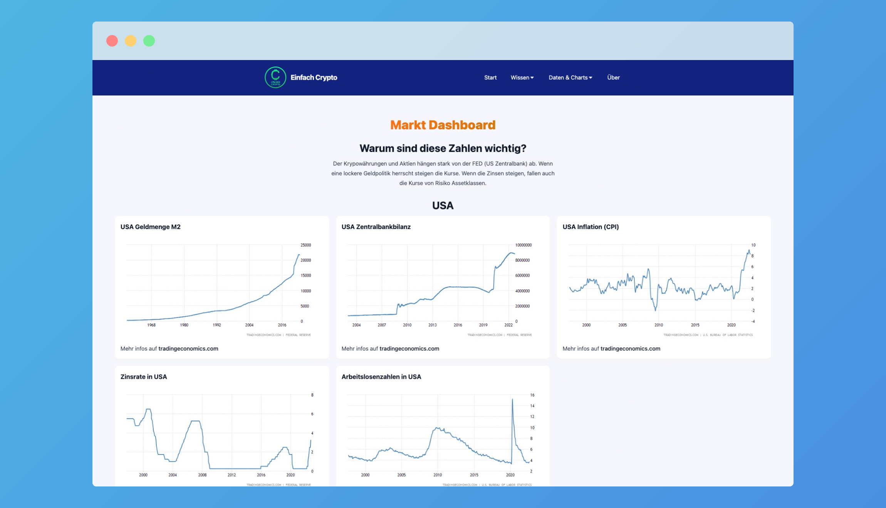

The first month of my "four projects in four months" has come to an end. Let's talk about what I accomplished, what I learned, before concluding.

## What did I achieve this month?

### 1. A Beginner's Guide to Bitcoin
- I researched a lot of german crypto-related websites and created [this bitcoin beginner guide](https://einfachcrypto.de/wissen/bitcoin-guide/).
  
### 2. Crypto calendar
- I compiled a list of crypto-related events and added them to a notions page.
- I made [a page](https://einfachcrypto.de/wissen/kalender/) where I display these events by month.
- You can suggest a new event by using my tally form, which adds the data directly to my notions database. All I have to do now is accept it ✅.

### 3. Market Research
- Economic data such as the inflation rate, money supply, unemployment rate, and CPI rate are displayed on [the market dashboard](https://einfachcrypto.de/dashboard/market-dashboard/).
- I wrote a background job that imports data from CoinGecko into my database.
- Display all coins in a table where you can [customize the columns](https://einfachcrypto.de/coins/) for easier comparison.
- Each coin has a details page (for example, [Ethereum](https://einfachcrypto.de/coins/ethereum/)) where you can find all links and additional information. This page can be extended with further useful information in the future.

### 4. General improvements to the site
- I added a nice list of services to the [start page](https://einfachcrypto.de/). The same list is reused on other pages like [this one](https://einfachcrypto.de/dashboard/).
- Ask for cookie consent and data privacy. Do not display Google Trends charts without permission.
- My [social link page](https://einfachcrypto.de/ig/) has been updated.
- A lot of code improvements have been made under the hood. For example, improved build speed and automatic dependency updates via GitHub actions.

## What did I learn?
- **GatsbyJS**: I improved my knowledge of GatsbyJS.
  - Learning here is, that consumes more effort than expected for basic problems like adding a sitemap. There is a nice plugin system, but these plugins still need more configuration than expected as each content type need to be defined.
  - And local build time is quite slow as all content is fetched.
- **SEO**: I improved my SEO knowledge in terms of on-page optimizations.
  - I improved the link structure as I observed warnings in Google Search Console. The lesson here was that Gatsby adds a trailing slash (`../slug/`) with a redirect and I used links without a slash. (`../slug`), which caused these redirects.
  - I learned how to configure Netlify to add redirects for not-available pages 
  - I tried out some tools like Screaming Frog to analyze my website and improve some headings.
- **Supabase**: I improved my knowledge of Supabase by using it as my database of coin data. I configured [RLS](https://supabase.com/docs/learn/auth-deep-dive/auth-row-level-security) for my tables and experimented with the [realtime feature](https://supabase.com/docs/guides/realtime) for live pricing updates. 
- **No-Code**: I am using n8n for background tasks like updating coin prices. I optimized my workflow here to  
- **Cloud functions** learned the use of Netlify's cloud function which I use to consume the up-to-date data from Supabase.
- **Contentful**: How to render rich text content on a GatsbyJS page. I thought it is easier, but you have to implement your own [rich text render].
- **Tailwind**: I practiced the use of Tailwind and learned how dark mode works. (Not enabled yet 🙂)
- **Social media**: I used Twitter more often than usual and tweeted with #buildInPublic. My result is that I have now 10 new followers 🎉.
- **Data privacy** is a pain if I want to integrate widgets from external websites. 

## Resume: What is a success?
I would say yes. I shipped a lot of features for einfachcrypto.de and improved my skill set during this month. I have now the basis to compare projects and improve my research. 
One missing part is to get some feedback from some users. This is something I will do if I talk with friends and people who DM me on Instagram.

## What is next
- SEO and Marketing

PS: You can follow my daily progress on [Twitter](https://twitter.com/m91michel).
