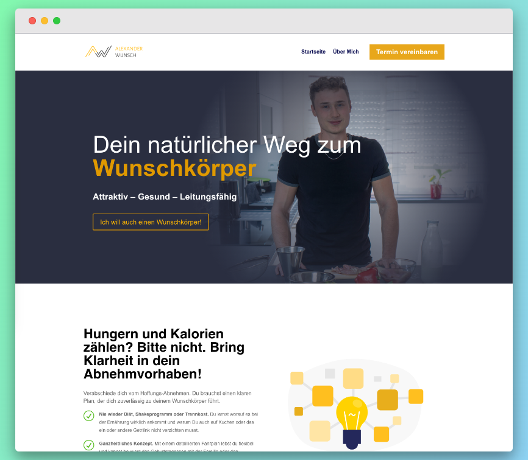

I completed the second month of my [4 projects in 4 months](/blog/2022-08-10-4-projects-in-4-months/). Here's what I have accomplished and what I have learned.

## Main goal
The primary objective of this project was to create a new design for the website of Alexander-Wunsch.de. Our first version was built with WordPress and Elementor, which had an outdated design. Therefore, the goal was to rebuild all pages using Divi Theme and create a more visually appealing design. The second goal was to think about marketing strategies, especially SEO opportunities. We wanted to find a tool for SEO research, analyze competitors, and check if there are opportunities to generate organic traffic.

## Achievements

Homepage <a href="https://alexander-wunsch.de" target="_blank">Alexander Wunsch</a>

### Website update
We rebuilt the website with a clean layout, updated content, and new images. The new website looks now much more professional.

Before I started rebuilding all pages, I did research on UI builder plugins for WordPress. The questions were either to stick with Elementor, pick Divi Theme, or use a theme with Gutenberg Blocks. I ultimately decided on Divi Theme because a friend gave me a license and I liked it more than Elementor. One thing I've learned is that all UI builders still require some CSS adjustments, so you'll always need to do at least some coding.

I completed a variety of maintenance tasks, including upgrading the PHP version, improving page speed by adding a cache and pruning images, updating plugins, activating auto-updates, removing google fonts, and implementing SEO improvements.

### SEO and marketing
I researched which SEO tool would be the best fit for this and future projects. I considered factors such as price and data accuracy. I ultimately decided on [ubersuggest](https://neilpatel.com/de/ubersuggest/) because it was a balance of affordability and data reliability.

I began the SEO research by analyzing our competitors. I identified some keywords that we want to rank for, but they are all quite competitive. I think the focus should go on getting press attention, which will lead to backlinks with high domain authority.

Our next focus will be an online webinar, where Alexander will present how someone can get healthy, thin and strong despite a stressful day. I researched solutions here on how we can collect appointment confirmations and get visibility. My first idea was to use meetup.com, but they changed their pricing where every organizer has to pay a monthly fee. We will use Eventbrite instead and create an event on LinkedIn and XING.

I also prepared a list with further marketing ideas for the future, but we are focusing on one thing at a time. So this is something we will work on in the coming months. 

## Wrap-up: Is this month a success?
The important goal for Alexander was to finish the website because he will hold a lecture for a local farmers association in November. The next milestone will be online webinars, for which we also need a nice-looking website. He is happy with the result so far. We still have to check how well the homepage converts and make some adjustments if necessary.

The main accomplishment for me was that I had the time to intensify my knowledge of SEO. I was able to do keyword research and get a feel for how ranking works. I now have a lot of ideas on how to get backlinks for SaaS and startup projects, and a list of growth tactics. This knowledge is something I can use in future projects.

PS: You can follow my daily progress on [Twitter](https://twitter.com/m91michel).