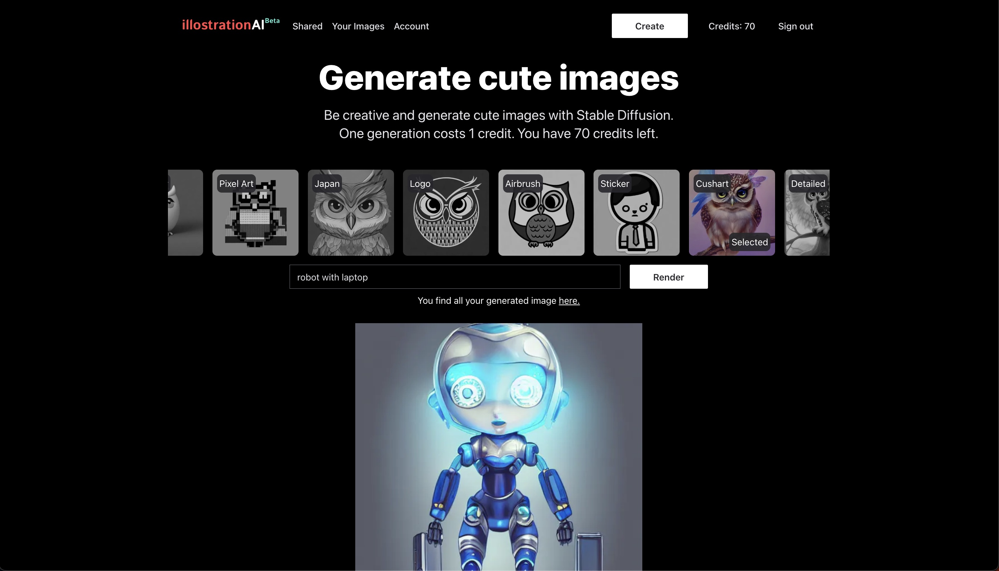

I completed the third month of my [4 projects in 4 months](/blog/2022-08-10-4-projects-in-4-months/). I changed the format of my blog post inspired by [yongfook](https://blog.yongfook.com/). Today I launch my first SaaS product, [illostration.com].

Illustration.com helps busy founders create illustrations for their startup's landing page. You select a style, describe your object, and the AI will generate an image for you.

## The customer problem

It can be difficult to find illustrations, especially if you're looking for something specific. Many sites require you to pay for access to their images, and the free options usually have a limited selection. Eventually, you end up paying for an expensive designer because you want something specific. There is a need for images that this [medium article] describes.

## The solution
### MVP
This year, a lot of text-to-image AI models were released. The idea is to use one of these generative AI tools to generate unique illustrations. One goal was to make it easy to use, so you don't have to engineer a complex text prompt to get an expected result. Therefore, you can select from a list of presets, which define the style of your generated image. You only have to describe your object and the AI will do the rest.

The UI - Select a preset, describe your object, and generate an image

Some examples of images. Used the preset at the top and the input at the bottom.

### Ideas for the future
There could be more features added, like editing a part of the image, upscaling, removing the background, uploading a base image, and creating multiple images at once. I could even integrate a full editor similar to [Canva](https://www.canva.com/), where you can add and move objects like text and images.
And of course, I could also improve the quality of the generation and add more options for presets.

But before I add more shiny new features, the goal is to get user feedback to only build features which bring validated value to the user.

## The business model

The business model is simple. You sign up and get 10 free credits. Generating one image costs you 1 credit. You can get more credits by subscribing to a plan where you get a specific amount of credits per month. For example 100 credits for $5 per month. The higher the plan, the better your credit package.

## The learnings
### Technical skills
I learned how to use the [Stripe](https://stripe.com/) API by integrating subscriptions and one-time payments. I was impressed by how they care about the developer experience and provide a lot of helpful utilities, like test mode, logs of every event, and a CLI that makes it easy to receive webhooks in your local environment.

I also tried out more Supabase features, like the authentication system. You can log in to [illostration.com] with GitHub or your Google account. I learned that it's easier than expected. You just have to grab your client id and client secret from the provider and configure them in the Supabase UI.

Unfortunately, the Supabase local development environment is [not feature-complete], which makes it difficult to use it for local changes. I decided to use two Supabase instances for development/staging and production instead, where I had issues with the migration feature of the CLI. Overall, the local environment and the migration feature feel not finished. This is something I have to consider in the following projects. One solution could be to use Supabase for authentications and Prisma to access the Postgres DB which is hosted by Supabase.

My last insight is that I choose [NextJS](https://nextjs.org/) as my frontend framework for all my following projects. I gathered experience with [Vite](https://vitejs.dev/) during work and [GatsbyJS](https://www.gatsbyjs.com/) in the first month of my [4x4](/blog/2022-08-10-4-projects-in-4-months/), but NextJS is the best option in terms of flexibility, performance, and maintainability.

### How can I involve the customers
This is a part where I can improve in the future. At the start of the month, I had a list of a lot of ideas, but they were all not validated and it took me some time to commit to illostration.com. I started the project with a landing page where users can sign up for early access but did not promote it. I directly started to build the MVP.

What I will do in the future? Validate your ideas more and get customers first. Then start building with customers in the feedback loop.

## Outlook
This month was focused on the technical aspects of building an MVP, which I can use as a boilerplate for future projects. The idea for next month is to focus on validation and customer feedback. This means that I will pick some ideas and validate them more thoroughly. The goal is to have some validated ideas that I can start building as a side project next year.

[illostration.com]: https://www.illostration.com/
[medium article]: https://medium.com/the-side-hustle-club/side-hustle-ideas-for-people-who-are-too-embarrassed-to-write-ba1b6da795c
[not feature-complete]: https://supabase.com/docs/guides/cli/local-development#limitations
