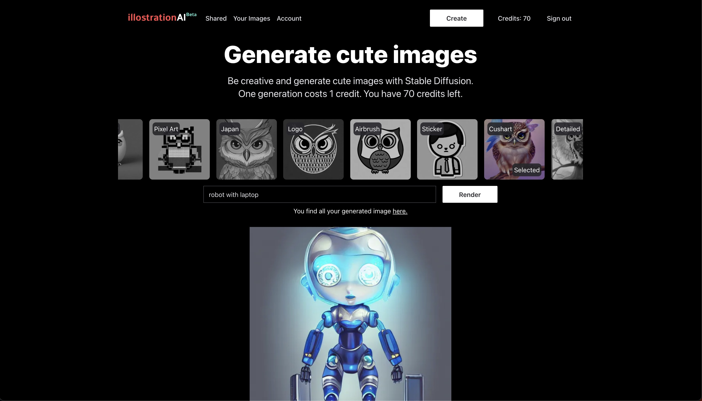
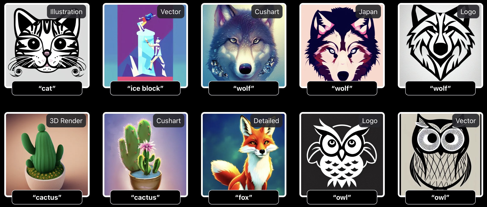

I completed the third month of my [4 projects in 4 months](/blog/2022-08-10-4-projects-in-4-months/). I changed the format of my blog post inspired by [yongfook](https://blog.yongfook.com/). Today I launch my first SaaS product, [illostration.com](https://www.illostration.com/).

Illustration.com helps busy founders create illustrations for their startup's landing page. You select a style, describe your object, and the AI will generate an image for you.

## The customer problem

It can be difficult to find illustrations, especially if you're looking for something specific. Many sites require you to pay for access to their images, and the free options usually have a limited selection. Eventually, you end up paying for an expensive designer because you want something specific. There is a need for images that this [medium article] describes.

## The solution

This year, a lot of text-to-image AI models were released. The idea is to use one of these generative AI tools to generate unique illustrations. One goal was to make it easy to use, so you don't have to engineer a complex text prompt to get an expected result. Therefore, you can select from a list of presets, which define the style of your generated image. You only have to describe your object and the AI will do the rest.

The UI - Select a preset, describe your object, and generate an image

Some examples of images. Used the preset at the top and the input at the bottom.

## The business model

The business model is simple. You sign up and get 10 free credits. Generating one image costs you 1 credit. You can get more credits by subscribing to a plan where you get a specific amount of credits per month. For example 100 credits for $5 per month. The higher the plan, the better your credit package.

## Resume: Is this month a success?

PS: You can follow my daily progress on [Twitter](https://twitter.com/m91michel).

[medium article] https://medium.com/the-side-hustle-club/side-hustle-ideas-for-people-who-are-too-embarrassed-to-write-ba1b6da795c
