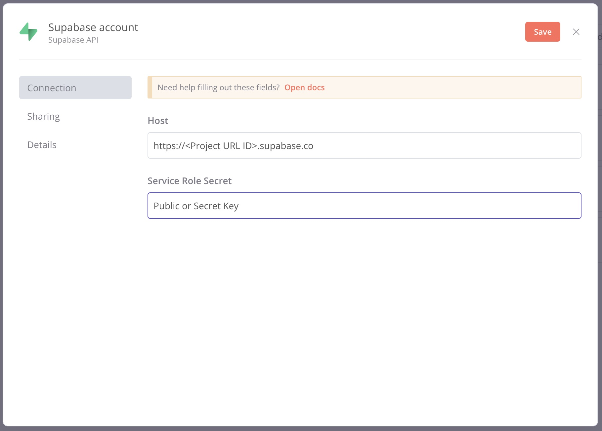
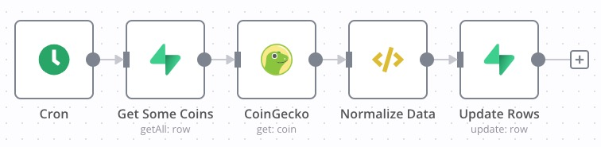
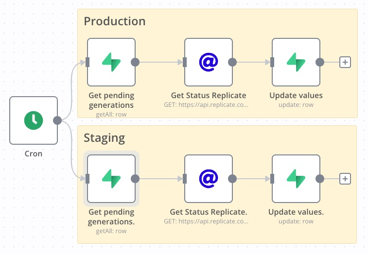
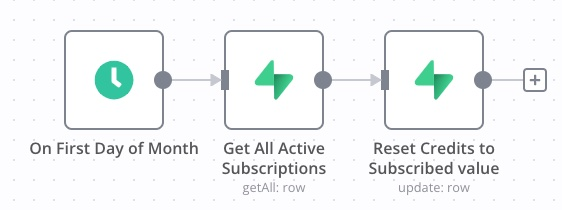

If you're looking for a way to run background jobs, Supabase and n8n are two great options. [Supabase](https://supabase.com/) is a open source Firebase alternative, and n8n is a open source Node-based workflow automation tool. Together they are a powerfully combination for background tasks. 
In this post, I'll show you how I to used these two tools for my projects [einfachcrypto.de] and [illostration.com].

## Setup of Supabase and n8n
If you have not worked with Supabase or n8n, here are some steps on how you can set these up.
- Create a project on [Supabase](https://supabase.com/) 
- Either use the [cloud version](https://n8n.io/cloud/) of n8n or you can host it on Railway. They offer a [template](https://railway.app/new/template/zo8wVU) which you can use.
- Connect your Supabase by creating a credentials entry in n8n. You can find them in Supabase under `Project Settings` -> `API`. You can read more [here](https://docs.n8n.io/integrations/builtin/credentials/supabase/)

## 1. Update coin data from CoinGecko
My passion project, einfachcrypto.de, lists the top 250 cryptocurrencies. It is a static site built with GatsbyJS. The list of cryptocurrencies is saved in a `coins` table in Supabase, and the [gatsby-source-supabase] plugin pulls all the data into the frontend. [CoinGecko](https://www.coingecko.com/) is the main datasource. As the data, especially the price, changes quite often, I needed a way to update some of the data regularly. I am using n8n for a cron-triggered job, which fetches the latest information from CoinGecko and updates the coin entry in Supabase. This is how my workflow looks like.

**Explanation of the steps**
1. **Cron:** Trigger the workflow every X minutes.
2. **Supabase:** Get all coins which are outdated. I check the timestamp here to see when it was last updated.
3. **Coingecko:** Get the latest data for each coin.
4. **JavaScript node:** Normalize and prepare the data structure so that it can be easily saved to columns.
5. **Supabase:** Update normalized data into the Supabase

## 2. Check the status of AI generation
I am using [replicate.com] to run the stable diffusion AI model for illostration.com. It is an AI infrastructure service that runs AI image generation (they call them predictions) for me. The API is built so that you first send a post request which triggers [the prediction]. You then have to poll every second and check the status of the prediction to see if it is finished. The response also includes the generated image. In Supabase, each prediction is saved in a predictions table, so I can track the status and retrieve the image.

This polling usually happens on the client side, but I have a case where I create multiple predictions in bulk. I am using a background job to update the status of the prediction and to retrieve the generated images. As I have production and staging Supabase environments, I am doing the same steps for both.

**Explanation of the steps**
1. **Cron:** Trigger the workflow every X minutes. (1 minute in my case)
2. **Supabase:** Get all predictions with a status of `pending`.
3. **HTTP Node:** Get the latest status from replicate API. This also gets the image url of the result.
4. **Supabase:** Update status and image url in `prediction` table

## 3. Reset credit at the end of the month
I used the [nextjs-subscription-payment](https://github.com/vercel/nextjs-subscription-payments) boilerplate for illostration.com. This boilerplate already includes two tables, `subscriptions` and `users`. For my credit system, I decided to keep it simple and just add a column for `credits` on the `users` table. Now I only have to check for active subscriptions and reset the credits at the end of the month. Each subscription includes the user_id and the amount of credits included.

**Explanation of the steps**
1. **Cron:** Trigger the workflow on the first day of each month
2. **Supabase Get:** Get all active subscriptions.
3. **Supabase Update:** Update user based on `user_id` and reset credits to the subscribed amount.

## Resources
- Check out Supabase launch week 6, which starts next week. They are releasing amazing features to Supabase in the next days. Head over to their [launch week page] and register for free.
- [Supabase Documentation](https://supabase.com/docs/reference)
- [N8n documentation](https://docs.n8n.io/)
- [Replicate Documentation](https://replicate.com/docs)

[launch week page]: https://supabase.com/launch-week
[illostration.com]: https://www.illostration.com/
[replicate.com]: https://replicate.com/
[einfachcrypto.de]: https://einfachcrypto.de/
[gatsby-source-supabase]: https://www.gatsbyjs.com/plugins/gatsby-source-supabase/
[the prediction]: https://replicate.com/docs/how-does-replicate-work#how-to-run-models-with-the-api