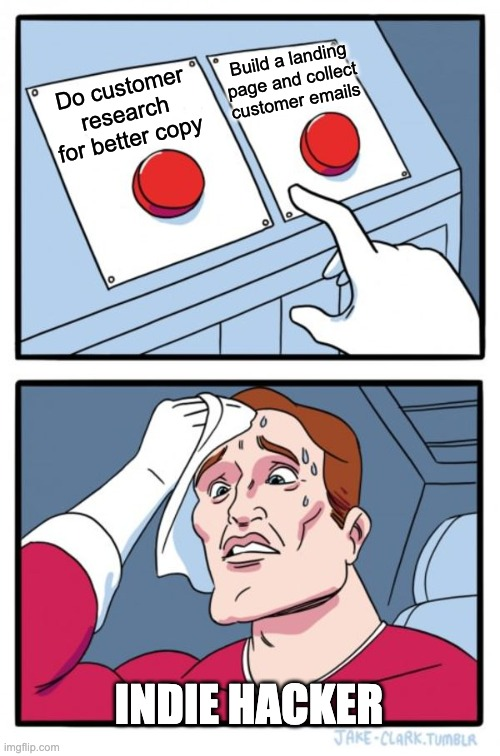

I completed the last month of my [4 projects in 4 months](/blog/2022-08-10-4-projects-in-4-months/). My actual goal for this month was to create two landing pages for validation and to make 3-5 customers calls where I can apply the learnings from the book “the mom test”. I ended up researching multiple ideas, and most of them did not convince me to go deeper. And on top of that, I got sick at the end of the month, which also decreased my productivity. So in this blog post I am presenting some ideas I investigated and sharing some further results.

## NotionHook
**Problem:** Notion does not provide a webhook which notifies you about new entries. This means that you have to check the API regularly for new entries. This [reddit post](https://www.reddit.com/r/Notion/comments/nd76ec/notion_api_webhooks/) shows that people are searching for it.

**The idea:** Build a SaaS solution where users can enter their notion token and a webhook URL. Every time a new entry is added or changed, the URL will be called. The MVP can be build easily with no-code tools to validate the demand.

**Why I dropped this idea:** There are two reasons...
1. There is not enough demand in terms of search volume.
2. I can't think of a good reason why someone would use this, except to trigger a Zapier workflow. Zapier, Make, and n8n all already provide a similar solution.

## Vectorize images with the help of AI
**Problem:** One problem that I have heard multiple times is that AI artists want to convert their AI-generated images into SVG images. The benefit of doing this is that you can then change parts or colors of the image and you get a high resolution.

**The idea:** My idea was to build a workflow where I use the [img2img] feature of Stable Diffusion to reduce the details of an image by converting it into a vector style graphic. In the second step, I could then use open source libraries to vectorize the simplified image.

**Why I dropped this idea:**
There are already some great solutions like [Vector Magic] or [vectorizer.ai]. I tried them out with some of my generated artworks and they offer much better results than I could have imagined. They also offer more options than my workflow would. 

## Instagram DM after follow
**Problem:** It's important on social media to engage with your followers. This is something I learned in the last months since I am more active on Twitter and I neglected it for my account [einfach_crypto]. I therefore asked myself if the features of some Twitter tools could be applied to Instagram.

**The idea:** Inspired by [hivoe.com] which automatically sends a DM to new followers, the idea was to build something similar for Instagram.

**Why I dropped this idea:**
I dropped this idea because of multiple reasons. On the one hand, Instagram works differently than Twitter, as Instagram is more against automated DMs. On the other hand, there are already some [tools available](https://dmpro.app/) for automated outreach. Lastly, I started to feel uncomfortable with Instagram because the platform evolved into a big advertisement and dopamine machine. So I don't want to contribute to that.

## Price List AB Testing Tool
**Problem:** Getting the correct pricing for your SaaS is hard. There are already some payment provider like Stripe, but most entrepreneurs still implement their own pricing table.

**The idea:** The problem is based from [this video](https://youtu.be/uYRq60G5XTk?t=511). The features could be to provide an easy to integrate pricing table where SaaS owners can manage their pricing table and optimize it by experiments.

**What I found out during my research:** There are already some solutions like [pricewell.io](https://www.pricewell.io/) or [billflow.io](https://www.billflow.io/) which have been acquired by Stripe. I found out that [AB testing of prices does can be also bad](https://www.priceintelligently.com/blog/ab-test-pricing-page-strategy), as you need a lot of traffic to get a significant result.

**Why I dropped the idea (for now):**
1. This idea was difficult to grasp and to define a clear MVP. It requires some basic features first, like a general pricing table. AB testing can only be done on top of an existing feature set.
2. As I have limited time, I decided to drop the idea for this month. This idea could be something for next year if I can grasp the problem and a possible solution more.

## Create Lifestyle Product photos with your desired background
**What are lifestyle product photos?** A good example is a product page on amazon where the first images show the product from multiple angles with a white background, and then there is also one so-called lifestyle image, where you show your product being used by your target customer. Another use case for lifestyle product images are marketing campaigns for example on social media.

**Problem:** These lifestyle product images are hard to produce. There is a whole industry to of photographers who are specialized for the creation of these images.

**The idea:** Is it not easier to upload one image of your product and let the AI tool place your product on the desired background?

**Research**
- I was initially skeptical about whether the current AI version could achieve good results, but then I found this [Reddit post].
- I found a few photo studios which specialize in product photos, so there is definitely a need for it. For example, [prodoto.com](https://www.prodoto.com/cgi).
- During my research for the competition, I found [Photostudio](https://product-photography.vercel.app/) and [ClipDrop](https://clipdrop.co/replace-background), which both offer the same idea. However, Photostudio is currently a MVP and shows an error message for me, while ClipDrop's results are not as good as expected.

**My progress here**
- This idea sounds quite promising. I know there is definitely a need for it.
- I was debating whether I should do customer research or check if I could build it technically. In the end, I was checking if I could generate nice looking images based on an input image. I also rented a stable diffusion instance on [runpod.io](https://www.runpod.io/), but I could not achieve good results. I have to invest more time here.
- Unfortunately, I got sick at the end of the month, which slowed down my progress.

## Further Archivevents
- I wrote a [blog post] for Supabase's launch week 6. I also shared it on IndieHacker and dev.to.
- One person purchased a subscription and I earned my first dollars online. 🎉
- I archived a quite good Twitter growth as I [tweeted about my first customer] and this tweet went viral
- Both the blog post and the Twitter growth resulted in good amount of traffic for IllostrationAI. 135 users signed up for a free account during December.

[img2img]: https://mccormickml.com/2022/12/06/how-img2img-works/
[Vector Magic]: https://vectormagic.com/
[vectorizer.ai]: https://vectorizer.ai/
[einfach_crypto]: https://www.instagram.com/einfach_crypto/
[hivoe.com]: https://www.hivoe.com/
[Reddit post]: https://www.reddit.com/r/StableDiffusion/comments/zjuczh/using_sd_as_a_design_tool/
[blog post]: /blog/2022-12-06-how-I-used-supabase/
[tweeted about my first customer]: https://twitter.com/m91michel/status/1607649501770039296?s=20
[price testing]: https://blog.hubspot.com/marketing/price-testing